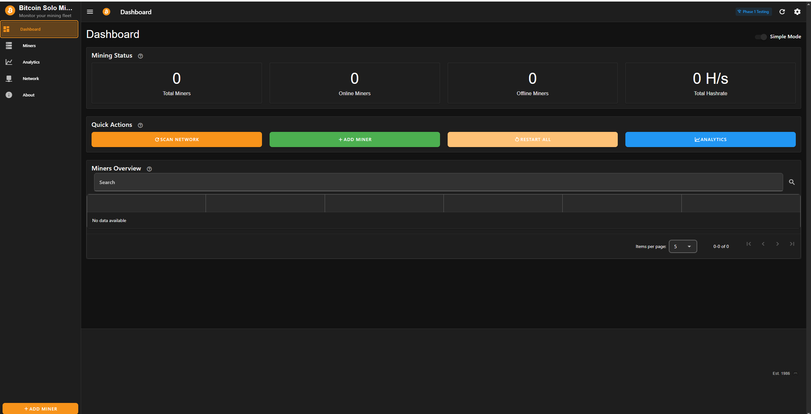
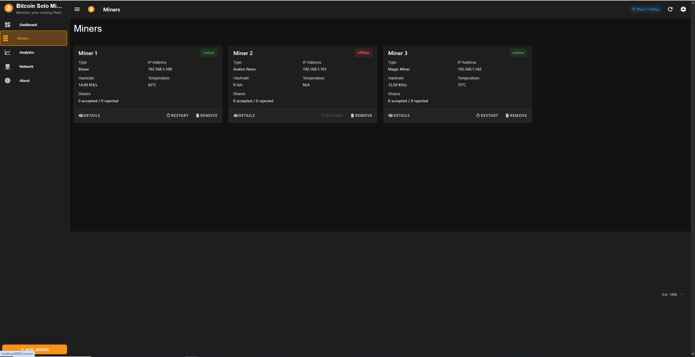
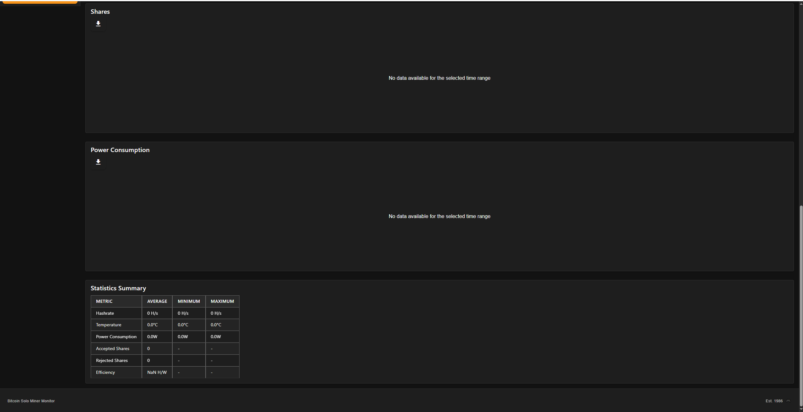
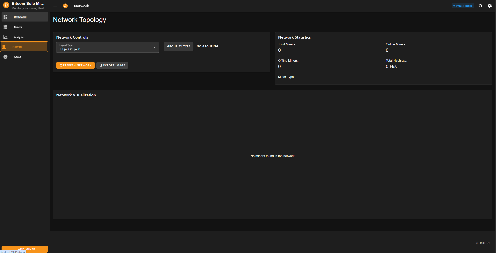
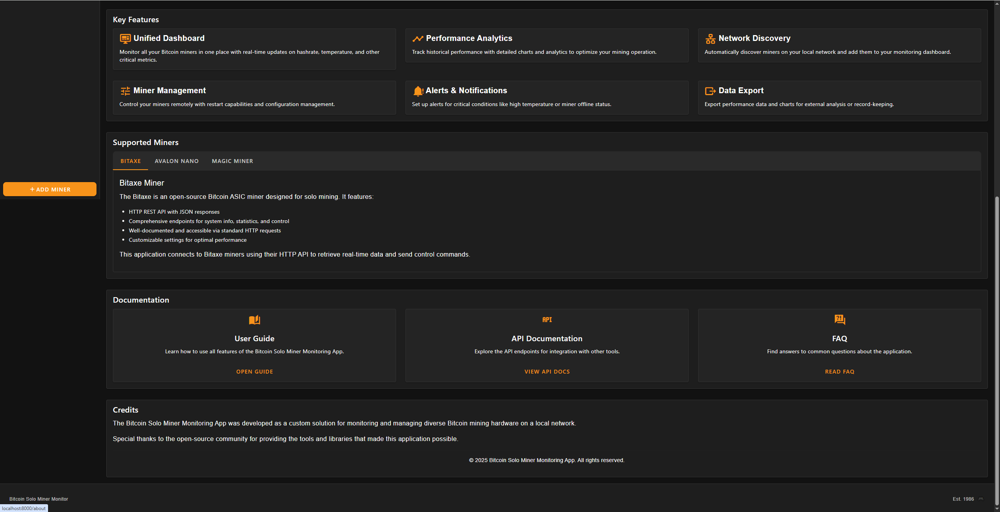

# Implementation Plan

- [x] 1. Create and implement information bubble component with hover and click functionality
  - Create new InfoBubble.vue component with proper hover effects and click handlers
  - Implement size increase and color change animations on hover
  - Add tooltip functionality with explanatory text
  - Integrate component into dashboard pages where "?" bubbles currently exist
  - Write CSS for smooth transitions and proper sizing
  - Test hover and click interactions across different browsers
  - Test the changes made to ensure that all functions work as intended before marking the task as complete
  - _Requirements: 1.1, 1.2, 1.3, 1.4_

- [x] 2. Restore dashboard button functionality for Scan Network, Add Miner, and Analytics
  - Implement scanNetwork function in Dashboard.vue with proper API calls and loading states
  - Connect Add Miner button to existing addMinerDialog functionality
  - Implement navigateToAnalytics function to route to analytics page
  - Add visual feedback (loading spinners, button state changes) for all button interactions
  - Test each button's functionality and error handling
  - Verify buttons work correctly and provide immediate user feedback
  - Test the changes made to ensure that all functions work as intended before marking the task as complete
  - _Requirements: 2.1, 2.2, 2.3, 2.4_

- [x] 3. Fix theme switching functionality to properly apply Dark/Light theme changes
  - I changed my mind and deleted these requirements, I now want to remove the Dark Light theme selector from the Wizard settings page as well as in the dashboard settings options. I want to simply use the current dark theme and leave it as is.

- [x] 4. Implement Simple Mode toggle functionality to switch dashboard views
  - Observe the code to see how the current toggle button works
  - Create handleModeChange function in Settings.vue to update UI mode
  - Implement localStorage persistence for Simple Mode setting
  - Update menu items computation in App.vue to respect Simple Mode state
  - Add routing logic to navigate between simple and advanced dashboard views
  - Ensure Simple Mode toggle works regardless of setup wizard choices
  - Test switching and verify dashboard view changes appropriately
  - _Requirements: 4.1, 4.2, 4.3, 4.4_

- [x] 5. Standardize footer sizing across Dashboard, Miners, and Network pages
  - Review these images to see the differing sizes of footers
    -
    -
    -
    -
    -
  - Define consistent footer height and styling in App.vue CSS
  - Apply standardized footer classes across all affected pages
  - Remove any page-specific footer overrides that cause inconsistency
  - Test footer appearance on Dashboard, Miners, and Network pages
  - Verify proper page layout and scrolling behavior with standardized footer
  - Ensure footer maintains consistent appearance across different screen sizes
  - _Requirements: 5.1, 5.2, 5.3, 5.4_

- [x] 6. Remove all mock miner data and implement proper empty state handling
  - Search for and locate mock miner data references
  - Remove mock miner data arrays from Dashboard.vue and related components
  - Implement empty state messaging for when no real miners are connected
  - Update data structure handling to work with empty arrays
  - Ensure all miner-related functionality works with empty data sets
  - Test application behavior with no miners connected
  - Verify proper display of empty state messages and UI elements
  - _Requirements: 6.1, 6.2, 6.3, 6.4_

- [x] 7. Restore connection status indicator to show actual connectivity instead of "Phase 1 Testing"
  - Update connectionStatusText computed property in App.vue to return real status values
  - Remove hardcoded "Phase 1 Testing" text from status display logic
  - Implement real-time status updates based on actual connection state
  - Ensure status indicator updates properly when connection state changes
  - Test status indicator with different connection states (connected, disconnected, error)
  - Verify status indicator shows appropriate text and colors for each state
  - _Requirements: 7.1, 7.2, 7.3, 7.4_

- [x] 8. Enable and implement refresh button functionality with proper data refresh
  - Remove disabled state and mock message from refresh button in App.vue
  - Implement refreshData function with proper loading states and error handling
  - Add WebSocket reconnection logic for disconnected states
  - Implement data refresh calls for all relevant data sources
  - Add proper user feedback with loading indicators and success/error messages
  - Test refresh functionality with different connection states and error scenarios
  - _Requirements: 8.1, 8.2, 8.3, 8.4_

- [x] 9. Implement temperature display formatting to show whole numbers only
  - Create formatTemperature utility function to round decimal values
  - Update all miner card components to use the formatting function
  - Apply temperature formatting consistently across Dashboard and Miners views
  - Ensure formatting maintains data accuracy while improving readability
  - Test temperature display with various decimal input values
  - Verify consistent formatting across all miner cards and temperature displays
  - _Requirements: 9.1, 9.2, 9.3, 9.4_