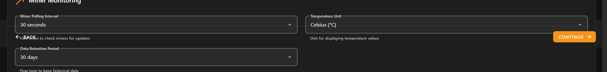

# Implementation Plan

- [x] 1. Fix navigation bar positioning and responsiveness

  - Update CSS in all wizard screen components to use static positioning instead of fixed
  - Ensure navigation bars are positioned at bottom of page content, not viewport
  - Remove any scroll event listeners that might interfere with button responsiveness
  - 
  - _Requirements: 1.1, 1.2, 1.3, 1.4_

- [x] 2. Standardize Bitcoin logo usage across all components

  - Update BitcoinLogo.vue component to use bitcoin-symbol.png and bitcoin-symbol.svg from root directory
  - Audit all wizard components for direct logo usage and replace with BitcoinLogo component
  - Test logo rendering at different sizes to ensure proper centering and alignment
  - _Requirements: 2.1, 2.2, 2.3_

- [x] 3. Fix widget selection highlighting in UserPreferencesScreen

  - Debug and fix the v-item-group selection state binding in UserPreferencesScreen.vue
  - Add proper CSS classes for selected and unselected widget states
  - Ensure multiple widget selection works correctly and persists visual feedback
  - _Requirements: 3.1, 3.2, 3.3_

- [x] 4. Resolve dropdown menu title visibility issues

[exapmle screenshot, notice how the lines go through the title text when hovered over](image-1.png)
  - Fix z-index layering in dropdown menus across all wizard screens
  - Improve text contrast and positioning to prevent title clouding
  - Test dropdown functionality in all wizard screens to ensure consistent behavior
  - _Requirements: 4.1, 4.2, 4.3_

- [x] 5. Simplify chart selection interface

  - Remove chart type dropdown from UserPreferencesScreen.vue
  - Update chartTypeOptions to only include line chart option
  - Simplify preferences data model to remove unused chart type options
  - _Requirements: 5.1, 5.2, 5.3_

- [x] 6. Clean up completion page content

  - Remove video tutorial button and references from CompletionScreen.vue
  - Update help section to only show available resources (documentation, community forum)
  - _Requirements: 6.1, 6.2, 6.3_

- [x] 7. Fix Launch Dashboard button navigation

  - Debug and fix the navigation logic in CompletionScreen.vue finish event
  - Verify FirstRunSetup.vue properly handles setup-complete event and routes to dashboard
  - Test end-to-end navigation from completion screen to dashboard
  - _Requirements: 7.1, 7.2, 7.3_

- [x] 8. Standardize information bubble styling

  - Identify the styling used in step 3 "settings" info bubble
  - Apply consistent styling to all information bubbles across wizard screens
  - Create CSS variables for standardized info bubble appearance
  - _Requirements: 8.1, 8.2, 8.3_

- [ ] 9. Email notification system audit and implementation
- [x] 9.1 Audit existing email service implementation

  - Search codebase for existing email service components, configurations, and implementations
  - Document what email functionality currently exists (if any)
  - Identify missing components needed for a complete email notification system
  - Analyze backend API endpoints for email-related functionality
  - Review configuration files for email service settings
  - _Requirements: 9.1, 9.2, 9.3_

- [x] 9.2 Implement complete email notification system

  - email-service-audit-findings.md
  - Develop missing email service components based on audit findings
  - Add email address input field to UserPreferencesScreen.vue notification section
  - Implement email validation for the email address field
  - Update preferences data model to include email_address field
  - Create or complete backend email service integration
  - Add email notification configuration and testing functionality
  - Ensure there are no security vulnerabilities exposed through the email notification service
  - _Requirements: 9.1, 9.2, 9.3_

- [x] 10. Update accent color options to match theme

  - Replace accent color options in UserPreferencesScreen.vue with theme-consistent colors
  - Ensure selected accent colors integrate properly with the application theme
  - Test accent color application to verify proper contrast and accessibility
  - _Requirements: 10.1, 10.2, 10.3_

- [x] 11. Fix progress bar orange color fill

  - Update progress bar CSS in FirstRunWizard.vue to use orange color for completion
  - Ensure progress bar updates immediately when steps are completed
  - Test progress bar visual feedback across all wizard steps
  - _Requirements: 11.1, 11.2, 11.3_